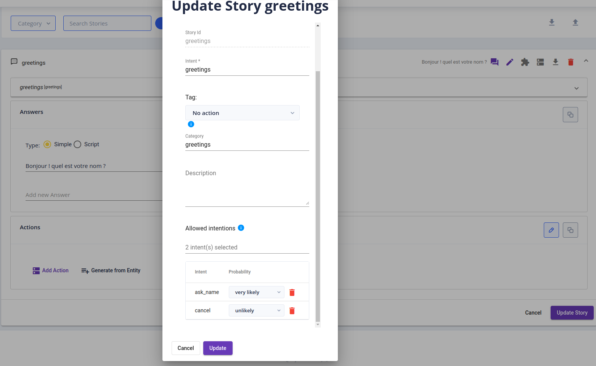

---
title:  Intent restriction
---
# Reducing the scope of intentions

In some cases, intention detection can be complex, in particular when training a part of the model is impossible due to the field of possibilities.
This is for example the case if we want to retrieve the last name of a user during a conversation.
during a conversation. It is obviously not possible to train an intention to detect all existing proper names.

Intent restriction allows you to limit the scope of eligible intents when leaving a story, whether it is configured via the studio or programmatically. Several intentions can be defined, each with a weighting that determines their preponderance over the others.

The intention restriction is only effective for the next action.


##Programmatic story

The nextIntentsQualifiers object is a ClientBus property that can be used in a programmatic story:
```kotlin
nextIntentsQualifiers =  listOf(
    NlpIntentQualifier("ask_last_name",10.0),
    NlpIntentQualifier("cancel",0.0)
)
```

the eligible intentions after this story are 'ask_last_name' and 'cancel', the latter being less likely to be triggered due to its lower weighting

##Configured story

The restriction of intentions can be done in the studio when editing a story.

Warning: If you define quick replies and a list of restricted intents, the intents associated with the quick replies will be added to the list of restricted intents.
This mechanism avoids conflicts where the restricted intentions defined would contradict the quick replies defined in the story.

The weights can take the following values:
* unlikely :
* likely : 0.5
* very likely : 0.9


